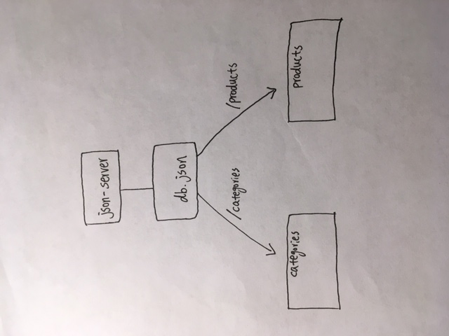

# LAB - 06

## Simple-api

### Author: David Zheng 

### Links and Resources
* [submission PR](https://github.com/davidzheng-401d32/simple-api/pull/1)
* [travis](https://travis-ci.com/davidzheng-401d32/simple-api)
* [back-end](https://davidzheng-lab-06.herokuapp.com/) 
* [front-end](https://codesandbox.io/s/api-client-k6z9o) 

#### Documentation
* [api docs](https://app.swaggerhub.com/home?loggedInWithSpec=true) (API servers)

#### Running the app
* `npm start`
* Endpoint: `/categories`
  * Returns a JSON object with categories in it.
* Endpoint: `/products`
  * Returns a JSON object with products in it.
  
#### Tests
No automated testing is required for this assignment 

#### UML

